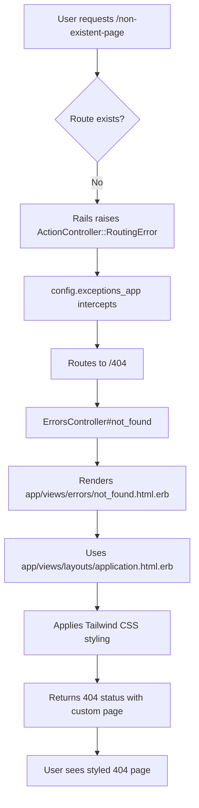
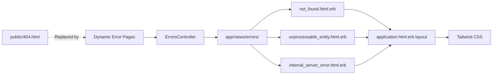
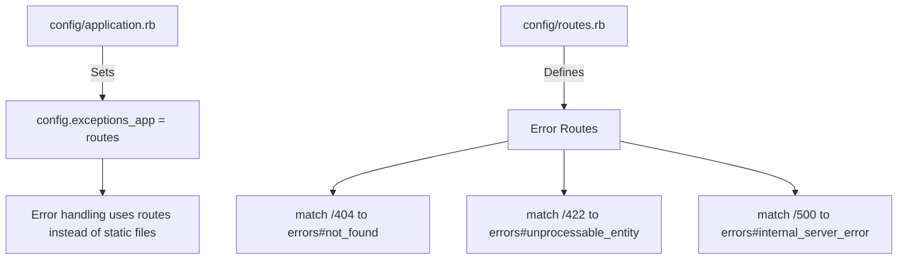
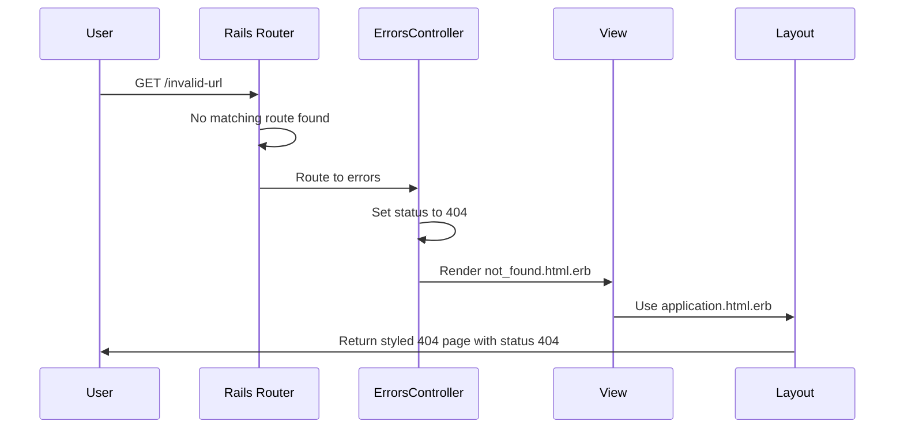
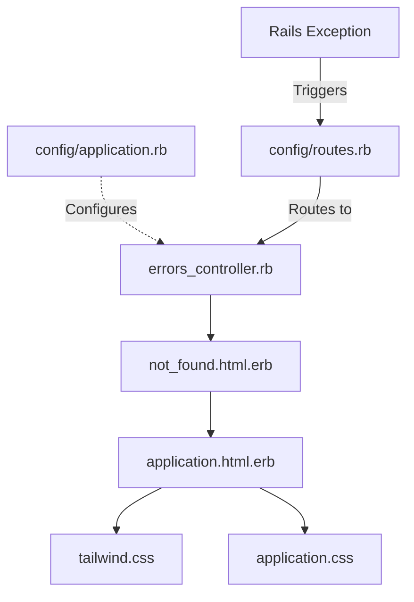
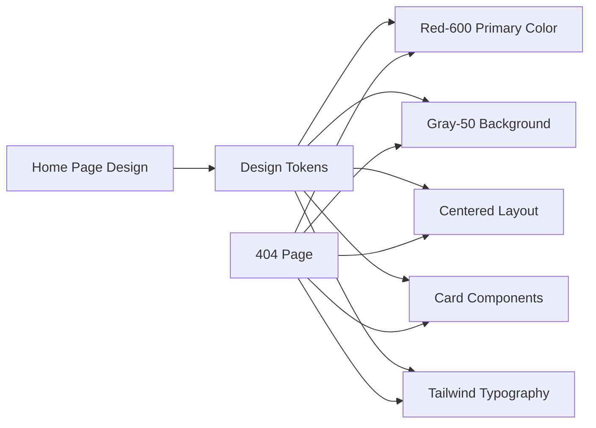
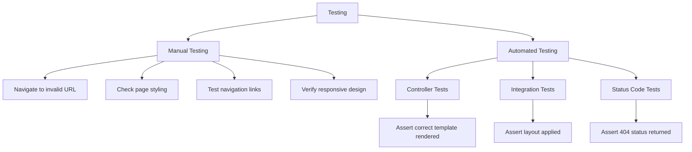

# 404 Page Architecture

## Request Flow Diagram

## Component Architecture

## Configuration Changes

## Error Handling Flow

## File Dependencies

## Design System Integration

## Key Design Decisions

### 1. Dynamic vs Static
- **Chosen**: Dynamic Rails-rendered pages
- **Rationale**: Allows use of application layout, Tailwind CSS, and Rails helpers

### 2. Controller Approach
- **Chosen**: Dedicated ErrorsController
- **Rationale**: Separates concerns, follows Rails conventions, easy to extend

### 3. Styling Strategy
- **Chosen**: Use application layout with Tailwind
- **Rationale**: Ensures consistency with rest of application, maintainable

### 4. Configuration Method
- **Chosen**: config.exceptions_app = routes
- **Rationale**: Standard Rails approach for custom error pages

## Benefits Summary

1. **Consistency**: Matches application design system
2. **Maintainability**: Uses standard Rails patterns
3. **Flexibility**: Easy to update content and styling
4. **User Experience**: Provides helpful navigation
5. **Extensibility**: Can add analytics, search, etc.

## Testing Strategy

