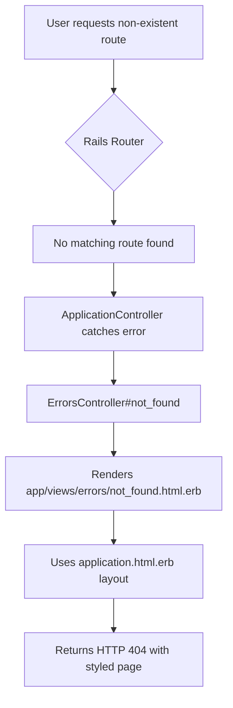

# 404 Page Implementation Plan

**Project:** Roo-Preview-Rails  
**Repository:** brunobergher/Roo-Preview-Rails  
**Date:** 2026-02-06  
**Type:** Dynamic 404 Error Page with Tailwind CSS

## Overview

Create a dynamic 404 error page that integrates with the existing Rails 8 application layout and Tailwind CSS design system, replacing the default static HTML error page with a branded, user-friendly experience.

## Current State Analysis

### Existing Setup
- **Framework:** Rails 8 with modern conventions
- **Styling:** Tailwind CSS (via `app/assets/tailwind/application.css`)
- **Layout:** `app/views/layouts/application.html.erb` with meta tags and asset pipeline
- **Design System:** Clean, minimalist with red accent colors (red-600: #dc2626)
- **Current 404:** Static HTML file at `public/404.html` with basic styling

### Design Language
From `app/views/home/index.html.erb`:
- Primary color: Red-600 (#dc2626)
- Background: Gray-50 (bg-gray-50)
- Typography: System fonts
- Layout: Centered, responsive with flexbox
- Components: Rounded corners, clear visual hierarchy

## Implementation Architecture



## Implementation Steps

### 1. Create ErrorsController

**File:** `app/controllers/errors_controller.rb`

**Purpose:** Handle HTTP error responses with proper status codes

**Implementation:**
```ruby
class ErrorsController < ApplicationController
  def not_found
    respond_to do |format|
      format.html { render status: :not_found }
      format.json { render json: { error: 'Not found' }, status: :not_found }
      format.all { render status: :not_found, body: nil }
    end
  end
end
```

**Features:**
- Handles multiple response formats (HTML, JSON, etc.)
- Sets proper HTTP 404 status code
- Inherits from ApplicationController for consistency

### 2. Create 404 View Template

**File:** `app/views/errors/not_found.html.erb`

**Design Specifications:**
- Full-height centered layout (min-h-screen)
- Gray background (bg-gray-50)
- Red accent for heading (text-red-600)
- Large, friendly error message
- Clear call-to-action button to return home
- Optional: Include a fun emoji or illustration
- Responsive design

**Key Elements:**
- Main heading: "404 - Page Not Found"
- Subheading: Friendly explanation
- Home button: Red background (bg-red-600) with hover effects
- Consistent spacing using Tailwind utilities

### 3. Update Routes Configuration

**File:** `config/routes.rb`

**Changes:**
```ruby
# Add after existing routes, before the end
get '/404', to: 'errors#not_found'
match '*path', to: 'errors#not_found', via: :all
```

**Purpose:**
- Explicit route for 404 errors
- Catch-all route for unmatched paths
- Handles all HTTP methods (GET, POST, etc.)

### 4. Configure ApplicationController

**File:** `app/controllers/application_controller.rb`

**Changes:**
```ruby
class ApplicationController < ActionController::Base
  allow_browser versions: :modern
  
  rescue_from ActiveRecord::RecordNotFound, with: :not_found
  rescue_from ActionController::RoutingError, with: :not_found
  
  private
  
  def not_found
    redirect_to '/404'
  end
end
```

**Purpose:**
- Catch database record not found errors
- Catch routing errors
- Redirect to custom 404 handler

### 5. Update Development Environment Configuration

**File:** `config/environments/development.rb`

**Current Setting:**
```ruby
config.consider_all_requests_local = true  # Line 6
```

**For Testing 404 Pages:**
```ruby
config.consider_all_requests_local = false
```

**Note:** Toggle this setting when testing error pages locally. Keep it `true` for normal development to see detailed error pages.

### 6. Verify Production Configuration

**File:** `config/environments/production.rb`

**Ensure:**
- Error pages are properly configured for production
- Static error pages in `public/` serve as fallback
- Logging is enabled for 404 errors

### 7. Optional: Update Static Fallback

**File:** `public/404.html`

**Purpose:** Serve as fallback if Rails application is down

**Improvements:**
- Update styling to match Tailwind design
- Use inline CSS (since asset pipeline won't be available)
- Match color scheme and typography
- Keep it simple and lightweight

## Design Mockup

### Visual Layout

```
┌─────────────────────────────────────────────┐
│                                             │
│                                             │
│              🔍                              │
│                                             │
│         404 - Page Not Found                │
│         (text-5xl, font-bold, text-red-600) │
│                                             │
│    Oops! The page you're looking for        │
│    doesn't exist or has been moved.         │
│    (text-gray-600)                          │
│                                             │
│    ┌─────────────────────────┐             │
│    │   ← Back to Home        │             │
│    │   (bg-red-600)          │             │
│    └─────────────────────────┘             │
│                                             │
│                                             │
└─────────────────────────────────────────────┘
```

### Color Palette
- **Primary:** Red-600 (#dc2626)
- **Background:** Gray-50 (#f9fafb)
- **Text:** Gray-800 (#1f2937)
- **Secondary Text:** Gray-600 (#4b5563)

### Typography
- **Heading:** text-5xl, font-bold
- **Subheading:** text-xl, text-gray-600
- **Body:** text-base, text-gray-600

## Testing Strategy

### Manual Testing

1. **Test Non-Existent Routes**
   - Navigate to `/this-page-does-not-exist`
   - Verify 404 page displays
   - Check HTTP status code is 404

2. **Test Different HTTP Methods**
   - Try POST to non-existent route
   - Verify proper handling

3. **Test JSON Requests**
   - Make API call to non-existent endpoint
   - Verify JSON error response

4. **Test Visual Design**
   - Verify Tailwind styles are applied
   - Check responsive layout on mobile
   - Confirm colors match design system

5. **Test Navigation**
   - Click "Back to Home" button
   - Verify proper redirect

### Development vs Production

**Development Testing:**
```bash
# In config/environments/development.rb
config.consider_all_requests_local = false

# Restart server
bin/dev

# Visit: http://localhost:3000/test-404
```

**Production Testing:**
```bash
# Deploy to staging/production
# Visit any non-existent route
# Verify custom 404 page appears
```

## Implementation Checklist

- [ ] Create `app/controllers/errors_controller.rb`
- [ ] Add `not_found` action to ErrorsController
- [ ] Create `app/views/errors/` directory
- [ ] Create `app/views/errors/not_found.html.erb` with Tailwind styling
- [ ] Update `config/routes.rb` with error routes
- [ ] Update `app/controllers/application_controller.rb` with rescue_from handlers
- [ ] Configure `config/environments/development.rb` for testing
- [ ] Verify `config/environments/production.rb` configuration
- [ ] Optional: Update `public/404.html` as static fallback
- [ ] Test 404 page by visiting invalid route
- [ ] Verify styling matches application design
- [ ] Test responsive layout
- [ ] Test JSON response format
- [ ] Document any additional features or considerations

## Benefits of Dynamic 404 Page

### User Experience
- ✅ Consistent branding with application
- ✅ Clear navigation back to working pages
- ✅ Professional appearance builds trust
- ✅ Responsive design for all devices

### Technical Benefits
- ✅ Uses application layout with proper meta tags
- ✅ Leverages Tailwind CSS framework
- ✅ Can include dynamic content (search, suggestions)
- ✅ Easier to maintain (one source of truth)
- ✅ Can log errors for analytics
- ✅ Better SEO with proper headers

### Development Benefits
- ✅ Follows Rails conventions
- ✅ Integrates with existing error handling
- ✅ Supports multiple response formats
- ✅ Easy to extend with additional features
- ✅ Testable with standard Rails testing tools

## Future Enhancements (Optional)

### Phase 2 Ideas
- Add search functionality
- Show recent/popular pages
- Include sitemap links
- Add "Report broken link" feature
- Track 404 errors in analytics
- Suggest similar pages based on URL
- Add fun animations or illustrations
- Multi-language support

### Additional Error Pages
- 422 (Unprocessable Entity)
- 500 (Internal Server Error)
- 503 (Service Unavailable)

## Notes

- Keep static `public/404.html` as fallback for when Rails is down
- Consider logging 404 errors for monitoring
- Monitor 404 patterns to identify broken links
- Update design as application evolves
- Ensure error pages are accessible (a11y)

## References

- Rails Guides: [Error Reporting](https://guides.rubyonrails.org/error_reporting.html)
- Tailwind CSS: [Utility Classes](https://tailwindcss.com/docs)
- HTTP Status Codes: [RFC 7231](https://tools.ietf.org/html/rfc7231#section-6.5.4)

---

**Next Steps:** Switch to Code mode to implement this plan.
